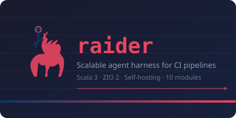

<div align="center">



# Raider

**Scalable agent harness for CI pipelines** — Scala 3 + ZIO 2

[](LICENSE)
[](https://www.scala-lang.org/)
[](https://zio.dev/)
[](#quality)
[](#quality-gates)

*A self-hosting coding agent that reads, searches, edits and runs code
in its own repository. Point it at a local or remote LLM and let it work.*

</div>

---

## What is Raider

Raider is an extensible agent harness for CI pipelines. The model gets tools
(read/search/edit files, run commands) and works on tasks inside your
repository. Supports OpenAI-compatible and Anthropic-compatible APIs.

## Quick Start

```sh
# Clone and build
git clone <repo> && cd scalaagent
COURSIER_CACHE=/tmp/cc-master sbt --batch compile

# Interactive chat with coding tools (fs_read, fs_search, fs_edit, proc_run)
sh scripts/selfdev/chat.sh --provider openai

# One-shot task
sh scripts/selfdev/raider.sh run --agent coder --provider openai \
  --input "Read README.md and describe this project" --out artifacts/selfdev
```

## Interactive REPL

The REPL gives you a **real Scala 3 compiler** with agent DSL — you can
compose pipelines, define agents, and run them against a live LLM.

### Launch the REPL

```sh
# Mock backend (no network, instant responses for testing DSL)
COURSIER_CACHE=/tmp/cc-master sbt --batch "raiderRepl/runMain raider.repl.Main"

# Live backend (llama.cpp on 8081)
RAIDER_PROVIDER=openai java -cp "$(COURSIER_CACHE=/tmp/cc-master sbt --batch --error 'export root/runtime:fullClasspath' | tail -1)" raider.repl.Main
```

### REPL examples — interactive session transcript

```
raider> val x = 1
val x: Int = 1

raider> case class Point(x: Int, y: Int)
// defined case class Point

raider> scout.ask("What is 2+2? Reply just the number")
val res0: String = "4"

raider> val task = scout("Read build.sbt and list modules")
val task: AgentAsk[String] = AgentAsk@...

raider> task.run()
val res1: String = "The project has 12 modules: core, runtime, dsl, ..."

raider> worker.start("Read errors.scala and count error families")
val res2: JobHandle[String] = JobHandle@...

raider> res2.await()
val res3: String = "There are 18 error families..."

raider> :jobs
j_1  Succeeded  worker: Read errors.scala...

raider> :quit
```

### REPL pipeline examples — compose agents

```scala
// Sequential pipeline: find → fix → verify
val result = scout("Find all TODO comments in src/").run()

// Parallel: two agents answer the same question
val (a, b) = all(scout, reviewer).ask("Is this code correct?")

// Map result
val length = scout("Count lines in README").map(_.length).run()

// Background job — starts immediately, you keep working
val job = worker.start("Analyze the error handling in AgentLoop.scala")
// ... do other things ...
job.await()  // blocks until done

// Multi-turn chat with context
val chat = openSession(worker)
chat.ask("Read the file AgentLoop.scala")       // model reads the file
chat.ask("Now explain the dispatch method")     // model remembers previous read
```

## CLI — one-shot tasks

```sh
# Run a task with the coder agent (has all tools)
sh scripts/selfdev/raider.sh run --agent coder --provider openai \
  --input "Read build.sbt and list the project modules" \
  --out artifacts/selfdev

# Run from a compiled bundle
sh scripts/selfdev/raider.sh run --bundle demo-bundle.jar \
  --workflow inspect --input "test data" --out artifacts/selfdev --mock

# Interactive chat with tools
sh scripts/selfdev/chat.sh --provider openai
```

## Real-Life Examples

### Example 1: Read a file and summarize

```
Input:  "Read the file called build.sbt using fs_read and tell me
         what this project is about in one sentence."

Agent:  → fs_read {"path": "build.sbt", "max_lines": 30}
        ← 30 lines, sha256=abc123...

Answer: "This is a Scala 3 + ZIO 2 multi-module project for CI pipelines
         with 12 modules including core, runtime, tools, and providers."
```

### Example 2: Search for code patterns

```
Input:  "Find all occurrences of AgentLoop in scala files."

Agent:  → fs_search {"query": "AgentLoop", "glob": "**/*.scala"}
        ← 12 matches across 5 files

Answer: "AgentLoop is defined in modules/runtime/.../AgentLoop.scala
         and used in cli, repl, and delegation modules."
```

### Example 3: Edit a file with sha256 verification

```
Input:  "Fix the typo in NOTES.txt: change 'Raiedr' to 'Raider'"

Agent:  → fs_read {"path": "NOTES.txt"}                    ← get current sha256
        ← content: "Raiedr self-dev start", sha256=def456...

        → fs_edit {"path": "NOTES.txt",
                   "content": "Raider self-dev start",
                   "expected_sha256": "def456..."}          ← stale-detect
        ← {"action":"modified","new_sha256":"abc789..."}

Answer: "Fixed the typo. File now reads 'Raider self-dev start'."
```

### Example 4: Run tests and report

```
Input:  "Run sbt --batch test and tell me if all tests pass."

Agent:  → proc_run {"argv": ["sbt","--batch","test"], "timeout_s": 300}
        ← {"exitCode": 0, "stdout": "...193 tests passed..."}

Answer: "All tests pass — 193 tests, 0 failures. Build is green."
```

## Agent Tools

| Tool | Description | Mutates |
|---|---|---|
| `fs_read` | Read a file (bounded, sha256 provenance, workspace containment) | No |
| `fs_search` | Search text in files (bounded, declared truncation) | No |
| `fs_edit` | Write a file (expected-sha256, atomic replace, stale-detect) | Yes |
| `proc_run` | Run a command (argv, no-shell, timeout, bounded output) | Yes |
| `delegate` | Start a sub-agent (same root budget) | Spawns |
| `await_agent` | Wait for sub-agent completion | — |

## Observability

Every agent run produces a **trace** — a bounded event log that makes the
work observable:

### Transcript (per-run JSON)

```json
{
  "rootId": "loop_1",
  "model": "unsloth/Qwen3.8-27B...",
  "events": [
    {"RunStarted":  {"at": "...", "model": "...", "messages": 1}},
    {"RoundStarted":{"at": "...", "round": 1}},
    {"ModelCall":   {"at": "...", "messageCount": 1}},
    {"ToolCallStarted": {"at": "...", "tool": "fs_read", "argumentsJson": "..."}},
    {"ToolCallFinished":{"at": "...", "tool": "fs_read", "resultJson": "..."}},
    {"TextReceived": {"at": "...", "text": "final answer"}},
    {"RunFinished":  {"at": "...", "outcome": "Succeeded"}}
  ]
}
```

Written to `transcript.json` in each work directory after every run.

### REPL :log command

```
raider> :log j_1
=== trace: j_1 (8 events) ===
  RUN START  model=builtin:coder messages=1
  ROUND 1
    → model call (1 messages)
    → tool: fs_read (call-1) args: {"path":"README.md"}
    ← tool: fs_read OK: {"tool_call_id":"call-1","output":...
  RUN Succeeded: "The project is..."
```

### :trace command

Shows recent events from the current session:
```
raider> :trace
trace: 24 events
  → fs_read {"path":"README.md"}
  ← fs_read: {"tool_call_id":"...","output":...
  RUN START model=unsloth/Qwen3.8...
```

### Real-time stderr output

During agent execution, every tool call and model round is printed to stderr:
```
[round 1]
  → fs_read {"path": "README.md", "max_lines": 30}
  ✓ ← fs_read: {"tool_call_id":"...","output":{"content":"# raider..."}}
[round 2]
  → model (2 msgs)
  ← text: "The project is a Scala 3..."
```

## Providers

| Provider | Non-streaming | SSE Streaming | Tool Calls |
|---|---|---|---|
| OpenAI-compatible (llama.cpp, vLLM, …) | ✅ | ✅ | ✅ |
| Anthropic Messages (Claude API) | ✅ | ✅ | ✅ |
| Mock (fixture) | ✅ | — | — |

## Quality Gates

The project enforces quality through a protected gate registry
(`scripts/quality-policy/registry.json`). Gates are executed via
`make quality-changed QUALITY_EXECUTE=1`.

### Active Gates (fast profile)

| Gate | Command | What it checks |
|---|---|---|
| `self-registry-check` | `quality.py self-check` | Registry integrity + verify-negative self-tests |
| `sbt-compile` | `sbt compile` | Zero warnings (-Werror) across all 12 modules |
| `core-contracts-spec` | `ContractsSpec` | Canonical JSON roundtrips, typed negatives |
| `compile-fixtures` | `compile.sh` | Pinned dotc positive+negative compile fixtures |
| `plan-validate` | `plan/validate.py` | Docs links, JSON, card metadata |
| `sbt-test` | `sbt test` | 193 tests across all modules |

### Gate Profiles

| Profile | Gates | When |
|---|---|---|
| `fast` | all 6 above | Every code change (default) |
| `self` | self-registry-check | Quality runner changes |
| `static` | sbt-compile | All Scala/config changes |
| `unit` | core-contracts-spec, sbt-test | Behavior changes |
| `contracts` | core-contracts-spec, compile-fixtures | Public API/schema changes |
| `runtime` | sbt-test | Runtime/concurrency changes |
| `docs` | plan-validate | Documentation changes |

### Running Gates

```sh
# Full gate suite (default for any change)
make quality-changed QUALITY_EXECUTE=1

# Specific profile only
make quality-profile PROFILES="static unit"

# Verify evidence freshness
make quality-verify MANIFEST=artifacts/quality/<run-id>/manifest.json PROFILES=fast
```

### Evidence Manifest

Each gate run produces a JSON manifest with:
- Source fingerprint (SHA-256 of all tracked files)
- Per-gate status, exit code, log hash
- Test summary (passed/failed/skipped)
- Toolchain snapshot (java, sbt, scala versions)

```sh
# Verify a manifest against the current tree
make quality-verify MANIFEST=artifacts/quality/20261004-163645/manifest.json PROFILES=fast
# [verify] OK — fingerprint fresh
```

### Trace Listeners

The AgentLoop supports pluggable trace listeners. A listener receives every
event during execution and can record it, print it, or forward it:

```scala
val loop = AgentLoop(
  backend, tools, model, admission, root,
  trace = ev => myLogger.log(ev)  // pluggable listener
)
```

The CLI uses a composite listener that:
1. **Records** all events into a bounded buffer → written to `transcript.json`
2. **Prints** tool calls to stderr in real-time (colored output)
3. **Stores** them for the `:trace` / `:log` REPL commands

## Key Findings (compiler/library bugs found and fixed)

<details>
<summary>zio-streams: <code>empty *> s</code> drops <code>s</code></summary>

`ZStream.empty *> s` completes the combined stream without pulling `s`
(zip semantics). Use `++` + `.drain` instead.
</details>

<details>
<summary>Scala 3.9: E046 cyclic on member-select chains</summary>

`x.call.y` in certain contexts causes `Recursive value call needs type`.
Fix: intermediate `val` assignments or rename the parameter.
</details>

<details>
<summary>ZIO: non-daemon fork interrupted by supervisor</summary>

`.fork` (not daemon) inside `Unsafe.unsafe {}` — the runtime supervisor
interrupts children when the parent root fiber completes. Use `.forkDaemon`.
</details>

<details>
<summary>java.nio: <code>readNBytes(8192)</code> blocks streaming</summary>

`readNBytes` blocks until exactly N bytes or EOF — wrong for SSE streaming.
Use `read(buf)` which blocks until ≥1 byte.
</details>

<details>
<summary>Shutdown hooks: System.exit from hook deadlocks</summary>

Calling `System.exit` from inside a shutdown hook deadlocks
`Shutdown.runHooks`. Fix: hook = interrupt + bounded wait + return.
</details>

## Documentation

| Document | Description |
|---|---|
| [docs/selfdev-prompts.md](docs/selfdev-prompts.md) | Prompts for self-hosting |
| [docs/runtime-contracts.md](docs/runtime-contracts.md) | Runtime contracts (§1–15) |
| [docs/quality-gates.md](docs/quality-gates.md) | Quality gates specification |
| [docs/work/board.md](docs/work/board.md) | Execution board (statuses, evidence) |
| [docs/work/records/](docs/work/records/) | Work records with acceptance evidence |
| [docs/PROMPT-SELF-IMPROVE.txt](docs/PROMPT-SELF-IMPROVE.txt) | Self-improvement prompt for the coder agent |

## License

MIT — see [LICENSE](LICENSE).
