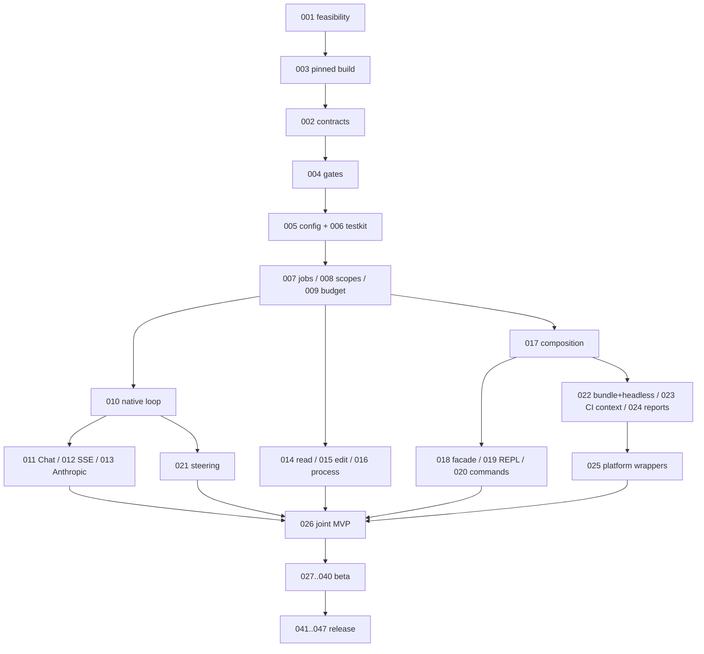

<!-- Translated from Russian original. Key terms preserved as-is. -->

# Этапы разработки

Актуальное уточнение 2026-10-03: [working target](working-product.md), [parallel runbook](parallel-development.md), [stage-aware gates](quality-gates.md). Старые IDs сохранены; milestone приёмка и полезный coding-agent результат различаются.


## 1. Приоритет и размер итерации

Главный продукт — portable headless agent runner внутри CI job. Все три класса сценариев входят в scope: review PR/MR, patch с фактическими checks, research/generation/checks. REPL нужен для создания и отладки тех же Programs; compiler отделяется от production runner. Native loop работает без Yabanin с двумя first-class protocols: OpenAI-compatible Chat и Anthropic-compatible Messages. Yabanin — optional integration.

Одна карточка задаёт проверяемый контракт. Если реализация превышает один понятный behavior/interface, перед назначением разбить её на дочерние `RAI-NNN.a/b/c` с теми же acceptance/allowed-path boundaries и независимыми records. Родитель accepted только при принятии всех частей. Не поручать простой модели весь transport/REPL/artifact subsystem одним большим diff. [Карточки](tasks/README.md) фиксируют milestone scope; [workflow моделей](model-workflow.md) ограничивает каждый implementation packet.

## 2. Milestones

| Milestone | Карточки | Результат | Выходной gate |
| --- | --- | --- | --- |
| M0a feasibility/foundation | 001–006 | Headless+REPL proof, pinned build, compile contracts, gates, config/mock | bootstrap → self/static/contracts |
| M0b runtime/protocols | 007–017 | Jobs/scopes/budgets/native loop, оба HTTP wires, local tools, composition | runtime/transport/tools/contracts |
| M0c product surfaces | 018–026 | REPL facade, bundle/headless CI, reports/exits/trust и тонкие platform templates | ci + real compiler/PTY + joint MVP |
| M1 beta ecosystem | 027–040 | Journal, typed agents, loaders/plugins/imports/bridges/sessions, optional Yabanin/eval export | full + compatibility + declared integration |
| M2 release quality | 041–047 | Protected task eval, accounting, soak, JVM/OCI package, dev CI/docs/release | release + supported integrations |
| P2 optional | 048–053 | Daemon, registered-step recovery, shared caps, live comparisons, quorum, MCP | Separate design/capability acceptance |
| Yabanin companion | YB-RAI-01–03 | Harness adapter, real executor, analytics | Yabanin собственные gates |

Числа — suffix RAI-ID. Всего 53 Raider cards и 3 optional companion cards. Это scope, не календарное обещание. Оценить throughput/remaining complexity после M0a; compiler/protocol feasibility важнее произвольной даты.

## 3. Критический путь



Exact dependencies карточек имеют приоритет. Main runtime не ждёт Yabanin companion PRs. Native/beta release capabilities можно принимать отдельно от optional bridge support; unsupported capability явно маркируется, не называется ready.

## 4. M0a: feasibility и frozen contracts

001 проверяет реальный Scala REPL embedding/classloader/prelude/JLine/signals и headless packaged execution. Измерить cold start, память, cancellation; сохранить reproducer и ADR. Не строить production compiler adapter до proof. Если official engine требует большого fork, рассмотреть узкий shell/engine adapter; custom parser пары команд не проходит requirement.

003 pins build/toolchain, 002 фиксирует Program/Task/Job/Workflow/Pipeline/checks/codecs/backend events/bundle/context/output schemas positive+negative compile fixtures. 004 создаёт command registry/classifier/fingerprints/evidence. Quality не откладывать до release; missing prerequisites остаются unavailable, не green skip.

005 freezes config/trust/policies/provider roles. 006 scripted backend/TestClock/bounded fake tools позволяет всем обычным gates обходиться без paid model.

## 5. M0b: native vertical slice

Job registry → scope ownership → root ledger → loop → оба wires. Loop не зависит от provider-specific messages; adapters переводят complete tool rounds/usage/errors. Anthropic Messages не fake Chat wrapper. Model/provider registry discovery optional. Standalone acceptance выполняется без YABANIN environment/service/module.

Tools только в temporary workspace. Read containment, hash-precondition edits, process groups/cwd/env/timeouts и sandbox capabilities проверяются отдельно. Parallel writers serialised или в отдельных worktrees. Native delegation запускается только после limits/profile-registry/capability intersection; model permit не держится во время child join.

Composition единая: apply строит Task, andThen sequential, all/batch parallel bounded, fork/join scoped. Deadline включает queue/retry/tools; lazy construction/printing не dispatch.

## 6. M0c: один сценарий в CI и REPL

Первый production-shaped acceptance:

```text
raider run --bundle pipelines.jar --workflow audit --ci generic \
  --context ci-context.json --input "Проверь проект" --mock --out artifacts/raider
```

Сценарий исполняется non-TTY со closed stdin, валидирует trusted checks, сохраняет result/events/JUnit/summary, отменяет детей по SIGTERM и возвращает truthful exit. Тот же bundle/Program на GitHub/GitLab env fixtures. Runner classpath без compiler/JLine. Наличие YAML не означает hosted integration готова: отдельное evidence реального job обязательно.

Локальная отладка:

```scala
scout.ask("Оцени проект")
val job = scout.start("Исследуй parser")
job.send("Особенно UTF-8")
job.await
(scout andThen reviewer).ask("Проверь архитектуру")
all(scout("Изучи cache"), reviewer("Изучи retry")).run()
batch(List("auth", "stream"), parallelism = 2)(scout(_)).run()
```

Prelude даёт profiles/launch capability; workflow body не использует blocking facade. Compiler error сохраняет bindings; background output не разрушает prompt; cancellation owner-specific. Setup route для missing credentials и всегда доступный честный mock.

MVP не включает durable arbitrary-Scala resume, shared cross-CI cap, daemon и external backend parity. Typed pipeline codecs/checks уже в M0; advanced typed model repair/context compaction в M1. Role profiles native baseline до importer cards не объявляются точной копией pi/OpenCode.

## 7. M1: beta extensibility и Yabanin

Journal/schema precede archives/sessions/eval exports. Importers переносят policy semantics и provenance, не только prompts. Binary JVM plugins trusted code; TypeScript extensions требуют внешнего backend, не JVM loading.

Pi RPC/OpenCode HTTP имеют собственные lifecycle/tool/cost/cancel capabilities; false parity блокирует launch при required guarantee. Pin versions и checked corpus. Unsupported nested attempt accounting не выдавать за complete.

Yabanin-first integration для желающих gateway: существующий `yb ci exec --session=on -- raider run ...`, inherited child env/labels/session owner. Native connection затем labels/doctor/root keys/stand/eval. Не mint второй session поверх inherited ybs_. Required gateway mode не обходит deny direct provider. Yabanin companion изменения только отдельными PRs с его правилами.

## 8. M2: release evidence

Доказать из clean distribution: standalone оба wires, CI/repl DSL, owned cleanup, bounded resource usage, truthful costs, protected checks, schema/hash consistency, safe artifact rendering, pinned OCI/JVM install и supported platform matrix. Compilers/protocols не считаются готовыми по mock интерфейса.

Base release full не требует существования deployed Yabanin; отдельный advertised Yabanin capability требует реального pinned mock-upstream stand. То же для внешних engines. Не публиковать release, license/signatures и spend без соответствующих owner решений.

Native-image не goal: динамический REPL/compiler это отдельная feasibility. Headless JVM/OCI split уже решает production compiler overhead без этой зависимости.

## 9. Контроль результата владельцем

На milestone — одна acceptance команда, один evidence verification command, actual report и known limitations. Владелец проверяет terminal/CI outputs, дерево jobs, cleanup и расходы/uncertainty. Model summary не доказательство.

Done карточки: dependencies accepted, contract cases passed, required gates passed/current, fresh review, actual work record. Done milestone: совместный сценарий accepted и все blockers закрыты. Done release: immutable source/dependency/policy fingerprint, validated artifacts и declared capabilities evidence.

Отложенные owner decisions: license/distribution ownership; supported OS/version matrix; live provider account/cap; performance reference machine; P2 budget authority. Local mock work может продолжаться до этих решений, платные вызовы/публикация сами по себе не разрешаются.
