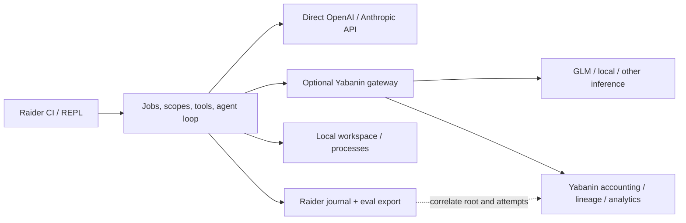

<!-- Translated from Russian original. Key terms preserved as-is. -->

# Raider + Yabanin

Yabanin — optional integration. Основной runtime, CI/REPL, model loop, tools и local budgets работают через прямые OpenAI-compatible/Anthropic-compatible profiles: [protocol contract](provider-protocols.md). Этот документ описывает дополнительные гарантии gateway, а не обязательную зависимость.

## 1. Проверенная локальная база

Изучен соседний checkout `tokenrouter`, HEAD `0dbb287ac46be0dbf95d77f87a066baa4c42add3`, 2026-10-02. [Snapshot](research/yabanin-snapshot.json) содержит hashes 24 конкретных файлов и их working-tree status. Файлы snapshot были clean. Это read-only исследование, не аудит всего продукта и не проверка deployed сервера.

Для исполнения карточек использовать `YABANIN_REPO=/path/to/checkout`. Не зашивать путь компьютера автора в scripts/build.

| Что обнаружено | Источник в Yabanin | Как использовать |
| --- | --- | --- |
| OpenAI-compatible gateway, routing/cache/failover | `README.md`, `docs/architecture.md`, `pkg/cli/gateway.go` | Один inference endpoint вместо отдельной реализации routing |
| Chat Completions, Responses, Models routes в текущем коде | `pkg/cli/gateway.go`, `pkg/cli/models_endpoint.go`, `pkg/cli/responses_endpoint.go` | Probe конкретного deployment, Chat-first adapter |
| CI child environment/session/report | `docs/ci.md`, `pkg/trcli/ci.go` | Wrapper-first integration через `yb ci exec`, без нового control plane |
| Attribution labels | `docs/labels.md`, `pkg/labels/header.go`, `pkg/cli/labels_mw.go` | Root/job/task/model-role attribution |
| Mint/revoke/finish/usage session keys | `pkg/cli/sessionkeys_api.go` | Scoped credential/accounting boundary |
| Decision metadata | `pkg/cli/decision.go`, `pkg/cli/chat.go` | Записать requested/actual model и routing evidence |
| Harness connect/disconnect/doctor | `docs/harness.md`, `pkg/harness/adapters/registry.go` | Добавить Raider adapter отдельной Yabanin-карточкой |
| Persistent delegation controller | `pkg/delegation/controller/*`, `pkg/trcli/delegate.go` | Сопоставить formats, не создавать два управляющих controller для одного job |
| Agent-eval contracts и fixtures | `pkg/agenteval/contracts/*` | Экспорт Raider episodes для независимой оценки |
| Quality runner и защищённый command registry | `scripts/quality/README.md`, `scripts/quality/commands.json` | Перенять модель evidence и gate classification |

Важное расхождение: `docs/api/openapi.yaml` описывает ограниченный Chat API, а текущий router содержит больше endpoint. `pkg/trcli/harness.go` также содержит устаревающее сообщение о неподдержанном `/v1/models`. Поэтому не генерировать весь Raider client из этого OpenAPI без проверки контрактов.

`yb delegate` в изученном коде запускает FakeExecutor по design и не является готовым live Scala-agent backend. Существующий MCP Orchestrator — отдельная поверхность; её наличие не доказывает parity с новой моделью jobs Raider.

## 2. Разделение ответственности



Raider owns agent lifecycle, context, tools, delegation, local budgets и workflow validation. Yabanin owns provider resolution/routing, своих auth principals, key/session policies, gateway costs и lineage. Raider не подключается напрямую к Postgres/Redis Yabanin и не импортирует его Go packages.

Model role (`fast`, `worker`, `review`, `architect`) — намерение Raider. Concrete requested model/alias — настройка Yabanin connection. Actual model берётся из response/evidence. Не дублировать cost-aware routing в двух местах по умолчанию.

Преимущество объединения: в Yabanin видно, какие workflow/агенты/attempts расходуют средства; в Raider видно, почему был вызван агент и что он сделал. Оба продукта полезны независимо.

## 3. Первый connection profile

Целевая конфигурация Raider, точная schema утверждается RAI-005:

```toml
[providers.yabanin]
kind = "yabanin"
base_url = "http://localhost:8082/v1"
api_key_env = "YABANIN_API_KEY"
session_key_mode = "optional"

[models.fast]
provider = "yabanin"
model = "configured-fast-alias"

[models.worker]
provider = "yabanin"
model = "configured-worker-alias"

[models.review]
provider = "yabanin"
model = "configured-review-alias"
```

Значения model намеренно placeholders. Реальные доступные IDs читаются из deployment/configuration. Не копировать названия из устаревшего tutorial и не обещать доступность конкретного GLM.

Credentials: env reference или structured helper command argv; значения не сохранять в TOML/history. Helper не вызывается через shell string, имеет timeout/output bound, stdout только credential, stderr sanitized. MVP env; helper — beta.

Base URL нормализуется один раз: к `/v1` добавляется `/chat/completions`, не второй `/v1`. Session-key API расположен относительно origin на `/v1/yabanin/...`; нельзя случайно построить `/v1/v1/yabanin/...`.

## 4. Capability doctor

`raider doctor --profile yabanin` по умолчанию не вызывает модель. Проверяет URL/TLS/config, доступность health, model registry при permission, status endpoint/session-key support без создания платного задания. Raw keys не выводятся.

Отдельный explicit `--probe-inference` запускает минимальный capped smoke, только когда выбран live режим/бюджет. Tool/stream/structured-output capabilities подтверждаются fixtures и таким smoke, не выводятся только из `/models`.

Результат сохраняет server version, checked timestamp, endpoint status, supported/unsupported/unknown, TTL capability cache, credentials mode без значения. 401/403 не равны unsupported; 501 session-keys-unavailable не означает, что обычный inference сломан.

## 5. HTTP и streaming

Yabanin connection MVP: `/v1/chat/completions`, tool calls, SSE, usage. Самостоятельные OpenAI-compatible Chat и Anthropic-compatible Messages входят в M0; [оба wires](provider-protocols.md) нормализуются независимо от gateway. Responses — будущий отдельный adapter. Yabanin `/messages` можно подключить через Anthropic wire после deployment-specific conformance; наличие route не означает готовые feature guarantees.

Parser должен пройти fixtures:

- UTF-8 codepoint разбит по network chunks;
- SSE frame и `data:` строка разбиты на произвольные куски;
- multi-line data, comments/keepalive, CRLF, пустые delta;
- content `null` при tool-only ответе;
- несколько tool calls с interleaved indices и частичными arguments;
- usage-only chunk, reasoning metadata, finish_reason и `[DONE]`;
- explicit provider error, invalid JSON, EOF до final marker, idle timeout;
- truncated oversized frame, cancellation посреди body;
- gateway denial of tool calls — фактически отсутствующие calls не выполнять;
- invalid output schema и bounded repair.

По возможности переиспользовать sanitized corpus Yabanin `pkg/apiformat/testdata`, зафиксировав origin/hash/license. Это копирование test fixtures в Raider, не link к изменяемой соседней рабочей папке.

## 6. Attribution и IDs

Request headers, подтверждённые исходниками:

```text
Authorization: Bearer <resolved credential>
X-Session-Id: <conversation UUID>
X-Yabanin-Task: RAI-021
X-Yabanin-Labels: <canonical encoded labels>
```

`X-Session-Id` — отдельный conversation/job identity; несколько независимых детей не пишут одновременно в одну conversation history. `raider.root` связывает их в одну работу.

Предлагаемые client labels:

```text
harness=raider
raider.root=<root-id>
raider.job=<job-id>
raider.parent=<parent-job-id>
raider.agent=<profile-id>
raider.workflow=<workflow-name>
raider.attempt=<attempt-id>
task=RAI-021
git.repo=yabaninai/raider
git.ref=<branch>
git.sha=<sha>
```

Это новый namespace client labels, не новые auth headers. Они принимаются только если org policy разрешает. Ключи сортируются, значения percent-encoded по Go `url.PathEscape`, пары comma-separated. Space, `+`, `/`, `,`, `=`, Unicode требуют cross-language golden tests; нельзя подменять PathEscape form encoding.

Изученные limits: до 20 labels на source, default 32 effective, value до 128 characters, prefix `yabanin.` reserved. Клиент выбирает ограниченный набор и показывает dropped/missing metadata; overflow не исправляет скрытым удалением `task`.

Locked key/session labels имеют приоритет над request. Labels атрибутируют расход, не дают разрешение. Raider не устанавливает `X-Agent-Id`, `X-Team-Id`, `X-Session-Key-Id` как источник собственной identity: gateway определяет их из authenticated principal.

High-cardinality root/job/attempt labels не добавлять автоматически в hourly rollup dimensions. Сначала запросные logs/export, агрегаты по workflow/agent/model role — согласованная Yabanin analytics карточка.

## 7. Session keys

Изученные routes:

```text
POST   /v1/yabanin/session-keys
DELETE /v1/yabanin/session-keys/{id}
POST   /v1/yabanin/session-keys/{id}/finish
GET    /v1/yabanin/session-keys/{id}/usage
GET    /v1/yabanin/usage
```

Mint требует parent `yb_` key с `can_mint_sessions`; session key не mint следующий key, agent principal не равен mint-capable parent. Есть ограничения TTL/rate и deployment DB availability. Численные limits проверяются против versioned contract, не perpetual hardcode без tests.

Предпочтительно один bounded session key на root workflow, общий для descendants; TTL/cap/labels root pinned. Credential reference хранится отдельно от journal. Agent profile получает opaque credential capability, а не parent secret.

Modes:

- `disabled`: обычный credential; local root limits, без утверждения gateway scoped cap;
- `optional`: unsupported mint capability позволяет запуск через явно сконфигурированный parent credential с видимым degraded status;
- `required`: mint/reconciliation failure блокирует запуск, никакого fallback parent key.

Нельзя перенести silent fallback поведения существующего `yb harness key` в strict mode Raider. Если helper возвращает parent key, capability check должен обнаружить отличие и не заявлять scoped credential.

При root completion отправить finish status с idempotent semantics согласно API; при explicit revocation — revoke. Failure не превращает agent outcome в success, хранится unresolved accounting state. Expiration/revocation не доказывает отмену уже dispatch upstream.

## 8. Расходы и routing evidence

Сохранять requested model, actual model если подтверждена, provider/backend, local AttemptId, gateway request/decision metadata, usage fields, estimates, observed amounts и accounting coverage.

Не считать `X-Yabanin-Decision` ответом на вопрос о task correctness. Он отражает gateway routing decision. Не обещать наличие gateway request ID, pricing snapshot или nested attempt IDs, если deployment их не предоставляет.

Usage endpoint содержит `complete`, `unpriced_requests`, totals/by_model и optional groups. Reconciliation ждёт bounded interval с учётом logger lag; incomplete не превращается в complete по таймеру. Конечная запись может быть `accounting_pending/partial/complete`, независимо от `execution_status`.

Session cap в существующем deployment надо проверить concurrency/unknown-price/streaming fixtures. В source есть post-hoc sessionbudget logic; наличие `max_cost_usd` поля не является доказательством строго нулевого overshoot. Raider root admission и gateway admission — две разные гарантии; заявлять их нужно только по измеренным контрактам.

Budget denial и policy denial не retry forever. Различать 429 rate limit и 429 budget exceeded по structured error; 403 model/whitelist denial terminal; 503 datastore failure не обходить direct provider.

## 9. Cache и side effects

Gateway cache replay не должен повторить filesystem/process mutation только потому, что transcript снова содержит тот же call. Каждый tool invocation имеет отдельную identity и execution ledger; это не даёт exactly-once после crash автоматически.

До live acceptance проверить cache policy для tool-bearing requests и identity/context keys. Не выдумывать request header для cache disable: использовать только подтверждённую gateway настройку/API. В fixtures явно cache on/off, повторный prompt, different tool schema, stateful session и parallel children.

## 10. Harness integration

В MVP Raider подключается к Yabanin endpoint через generic OpenAI-compatible URL/key profile. Enriched Yabanin connection/labels/doctor и wrapper lifecycle contract реализуются RAI-037/038. Следующий шаг — отдельная Yabanin карточка YB-RAI-01: adapter в `pkg/harness/adapters`, registry entry, managed config block, connect/disconnect/drift/doctor tests.

Config transaction должна сохранять пользовательские настройки, permissions, backups и secret references. Connect дважды идемпотентен; disconnect восстанавливает предыдущий config; drift не перетирается молча. У adapter отдельный runtime config schema version.

## 11. Agent-eval

Экспортировать compatible run directory: `manifest.json`, `episodes.jsonl`, `calls.jsonl`, `tools.jsonl`, `verdicts.jsonl` по JSON Schema 2020-12 из Yabanin.

Отдельные измерения: execution outcome, task outcome, safety outcome, protocol outcome, usage/cost/coverage. Process exit 0 не доказывает task success. Tool arguments в telemetry — digest, не raw secrets. Отказ инструмента содержит deny_reason.

Реальный verdict выдаёт protected deterministic verifier; модель не записывает себе success. Для research задач rubrics/LLM judge — только отдельный calibrated soft signal. Coding tasks проверяют diff/tests и сохраняют actual workspace hash.

## 12. Порядок объединения

1. Native standalone оба wires; optional gateway endpoint через generic Chat profile. Для CI пользователей затем существующий `yb ci exec` wrapper-first contract, без Go изменений.
2. Capability doctor и live free/local stand с mock upstream.
3. Labels/decision metadata и session-key modes.
4. Capped real provider smoke после deterministic free gate.
5. Agent-eval export и сравнение моделей на одинаковых fixtures.
6. `yb harness connect raider` отдельным Yabanin PR.
7. По подтверждённой потребности: Raider as executor для existing delegation protocol, без двух competing owners.
8. По подтверждённой потребности: dashboard links/usage drilldown и cross-process budget authority.

Yabanin modifications всегда проходят его `AGENTS.md`, applicable Go skills и `make quality-changed QUALITY_EXECUTE=1`; release/readiness — `make quality-full` плюс integration/acceptance. Gate success Raider не заменяет эти проверки.

## 13. CI wrapper-first integration

В изученном Yabanin уже есть `yb ci exec --session=on -- <command>`: child-only URL/credential/labels, сохранение дочернего exit и `yabanin-ci.json`. Это быстрый optional путь без Go modifications:

```text
yb ci exec --session=on -- raider run --bundle pipelines.jar \
  --workflow audit --input "Проверь проект" --ci auto --profile yabanin \
  --policy ci-readonly --out artifacts/raider
```

URL precedence в Raider: explicit CLI override → selected config URL → wrapper env, если profile объявляет env URL source. Credential resolve только через configured env reference; отсутствие config URL не запускает неизвестный endpoint автоматически. Schema RAI-005 фиксирует source и precedence. `YABANIN_LABELS` разбирается canonical decoder; bounded request labels добавляются с сохранением owner/locked CI attribution. Overflow виден, не просто overwrite wrapper environment.

Inherited `YABANIN_API_KEY` может быть `ybs_`: wrapper owns mint/finish/poll, Raider не требует mint-capable parent и не создаёт второй session. В run.json lifecycle owner `wrapper`, local budget/accounting coverage отдельно; descendants получают opaque same-root credential capability. Native own-root mode — RAI-038; если mint unavailable, optional degraded видно, required блокируется.

Yabanin CI contract описывает bounded poll: session `complete`, header две одинаковые bodies. Header stability не proof completeness. `yb ci report --pipeline --fail-over-cost` — post-hoc policy с exit 4, не concurrent spend prevention. GitLab Premium metrics widget optional; generic Raider artifacts/JUnit/accounting JSON не требуют paid tier.

Учитывать wrapper cleanup/poll (до 30s по изученному contract) в CI timeout помимо Raider grace/upload. SIGTERM forwarding/child env/session cleanup проверять actual wrapper acceptance, не предполагать из CLI syntax. Key не помещать в dotenv artifact; fork job не получает gateway key.

Raider run/result/checks говорят о task correctness, Yabanin report — об observed gateway usage. Один не подменяет другой. Root/pipeline labels связывают evidence без доступа Raider к внутренней DB.
